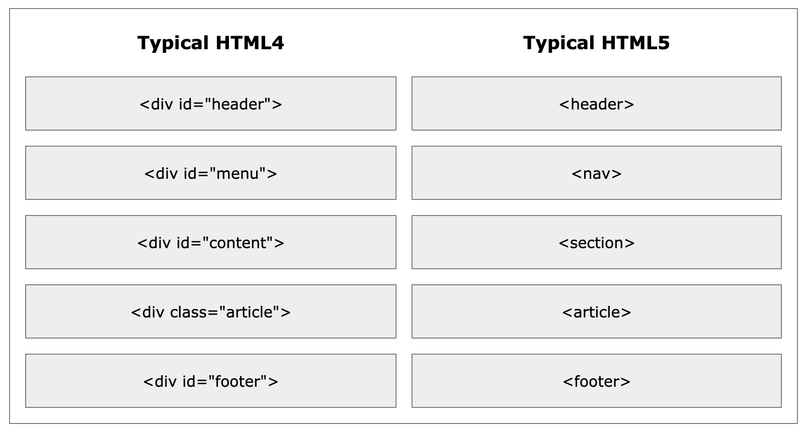

# Writing-and-Presentation-Test Week 1
## Day 1: Unix Command Line, Git & Github
## Unix Command Line
- Shell adalah program yang menerima perintah, kemudian meneruskan perintah tersebut ke system untuk dieksekusi.
- Command Line Interface adalah jenis shell yang berbasis teks.
- Selain command line, kita juga punya shell berbasis grafis yang lebih dikenal dengan nama GUI atau graphical user interface.
- Contoh GUI: Microsoft Windows, macOS, dan Ubuntu.
- Contoh CLI: sh, bash, zsh, cmd.exe
- Terminal Emulator adalah aplikasi untuk mengakses CLI.
#### Navigasi menggunakan CLI
- pwd (Print working directory): Command untuk melihat current working directory.
- ls (lists): Command untuk melihat isi file yang ada di sebuah direktori.
- cd <direktori> (change directory): Command untuk berpindah direktori.
#### Manipulasi file dan directory
- mkdir: Command untuk membuat direktori atau folder baru.
- mv: mencut atau memindahkan suatu file. selain itu dapat digunakan untuk merename suatu file.
- rm: menghapus suatu file.
- touch: Command untuk membuat sebuah file.
- cp: Command untuk mengcopy files atau directory
- cat: Command untuk melihat isi sebuah file.
## Git & Github
- GIT adalah Tools untuk programmer yang digunakan sebagai version control system.
- Version Control System: adalah mencatat setiap perubahan pada File (termasuk code yang kita buat) pada suatu proyek baik dikerjakan secara individu maupun tim.
- Git biasanya digunakan oleh para programmer sebagai tempat penyimpanan file pemrograman mereka, karena lebih efektif.
- File -file yg disimpan menggunakan git akan terlacak seluruh perubahannya, termasuk siapa yang mengubah.
#### Setup awal Git
- Configurasi Git: email yang disetup HARUS SAMA dengan yang digunakan pada GITHUB.
Git config –global user.name “IlyasBudi” <br />
Git config –global user.email wjati145@gmail.com
- Untuk melihat apakah setup berhasil dengan git config --list
#### Repository Git
- Repository adalah direktori proyek yang kita buat.
- Membuat repository <br />
git init (dilakukan didalam folder yang dibuat)
- git status untuk melihat apakah terjadi perubahan atau tidak pada git.
- git add untuk menambah file baru/file yang telah diubah pada git.
- git commit -m “pesan_anda” digunakan untuk menyimpan perubahan pada git.
- git log digunakan untuk melihat catatan revisi-revisi yang telah dilakukan.
- git push -u origin master digunakan untuk mengirimkan/perubahan file ke repository github.
- git branch -b [nama branch] digunakan untuk membuat branch baru.
- git checkout digunakan untuk berpindah branch.
- git revert akan membatalkan semua perubahan yang ada tanpa menghapus commit terakhir.
- jika menggunakan GIT Reset, commit terakhir akan hilang.
## Day 2:  HTML
- HTML adalah singkatan dari Hypertext Markup Language. Digunakan untuk menampilkan konten pada browser.
- Ada 2 tools utama yang harus dipersiapkan untuk membuat HTML yaitu browser dan code editor.
- Visual Studio Code merupakan salah satu code editor yang dibuat oleh Microsoft.
- Visual Studio Code merupakan paket All in One. Dapat digunakan untuk bahasa pemrograman apapun.
- Struktur HTML
```
  <!DOCTYPE html>
  <html lang="en">
    <head>
      <meta charset="UTF-8" />
      <meta http-equiv="X-UA-Compatible" content="IE=edge" />
      <meta name="viewport" content="width=device-width, initial-scale=1.0" />
      <title>Ini Judul</title>
    </head>
    <body>
      <h2>Ini Heading 1</h2>
      <h2>Ini Heading 2</h2>
      <h3>Ini Heading 3</h3>
      <article id="artikel">
        <h2>Lorem Ipsum</h2>
        <p>Lorem ipsum dolor sit amet consectetur adipisicing elit. Libero eum porro, molestiae accusamus quaerat consectetur debitis minus illum animi recusandae aspernatur, adipisci sint accusantium officia minima facere sunt exercitationem facilis?</p>
      </article>
    </body>
  </html>
```
- HTML element terdiri atas opening tag, content, dan closing tag.<br />
  Opening tag: ``<h1>`` <br />
  Content: Ini Heading <br />
  Closing tag: ``</h1>``
- HTML Attribute adalah properties dari sebuah HTML Element. Contohnya: id, class, name.
- HTML Comment digunakan untuk memberi keterangan pada suatu line code ``<-- -->`` 
- Agar tidak perlu reload saat ada perubahan pada file HTML maka bisa menggunakan extension “Live Server” pada Visual Studio Code.
#### HTML Tag untuk menampilkan text
- Heading: yang terbesar ``<h1>`` sampai ``<h6>`` yang terkecil.
- Paragraph: ``<p>``
- Link/Anchor: ``<a>``
- List terdiri dari 2 tipe yaitu:<br />
 1. Ordered list: ``<ol>``<br />
 2. Unordered list: ``<ul>``
#### HTML Tag untuk multimedia
- Gambar: ````
- Video: ``<video>``
- Suara: ``<audio>``
#### Semantic HTML
- Semantic HTML yaitu menggunakan elemen HTML sesuai dengan kebutuhan konten. Contoh yaitu header, footer, nav, section, aside, dll.<br />
HTML4: non-semantic<br />
HTML5: Semantic

## Day 3: CSS
- CSS adalah bahasa yang digunakan untuk mendesain halaman website.
- Dengan CSS, kita bisa mengubah warna, menggunakan font custom, editing text format, mengatur tata letak, dan lainnya.
- Ada 3 cara untuk menyisipkan CSS ke dalam HTML, yaitu:<br />
1.	Inline CSS, yaitu menggunakan attribute style untuk menyisipkan kode CSS langsung di dalam HTML element.<br />
2.	Internal CSS, yaitu menggunakan element <style> untuk menyisipkan kode CSS. Element <style> tersebut diletakkan di dalam element.<br />
3.	External CSS, yaitu sebuah file CSS terpisah yang disambungkan dengan file HTML dengan menggunakan element <link>.
- Cara mengakses file .CSS di HTML<br />
``<link href="styles.css" type="text/css" rel="stylesheet"/>``
- CSS Syntax adalah syntax yang digunakan untuk menunjuk atau memilih HTML element mana yang ingin diberi style (dihias). CSS syntax terdiri dari selector, property, dan value.
- Syntax nya seperti ini:<br />
```
Selector {
  property: value;
}
```
- Tag Id dan Tag Class bisa dipake di css namun Tag Class lebih bersifat fleksibel karena dapat diberikan lebih dari 1 nilai sedangkan Tag Id bersifat kaku karena hanya memiliki 1 nilai.
- !important CSS berada di level paling atas dari ID dan Class.
#### Flexbox
- Flexbox adalah suatu cara untuk mengatur layout atau tata letak
- Flexbox memudahkan para programmer untuk mengatur layout, posisi, dan ukuran dari tiap element di dalamnya.
- flex-direction: dapat menentukan arah item-item yang ada didalam container.
- flex-warp: item pada flex akan mencoba masuk atau fit ke dalam satu baris atau row.
- justify-content: property ini memungkinkan kita mengkontrol atas penyelarasan (alignment) item flex yang berada di dalam container.
- flex-start: semua item akan ditempatkan di depan.
- flex-end: semua item akan ditempatkan di belakang.
- center: akan menempatkan semua item ke tengah.
- space-between: akan memberi ruang pada setiap dua item yang bersebelahan.
- space-around: akan memberi ruang pada sekitar tiap item.
## Day 4: Algoritma & Intro to Javascript
## Algoritma
- Algoritma adalah prosedur atau tahapan logis dalam memecahkan suatu masalah tertentu secara sistematis.
- Ciri-ciri algoritma:<br />
1.	Input: memiliki 0 atau lebih inputan.<br />
2.	Output: Memiliki min 1 buah output.<br />
3.	Definiteness: Instruksi jelas tidak ambigu.<br />
4.	Finiteness: Memiliki titik berhenti (stop)<br />
5.	Effectiveness: Sebisa mungkin tepat sasaran dan efisien.
- Kenapa harus mempelajari algoritma:<br />
1.	Membantu memecahkan permasalahan tertentu secara logis dan sistematis.<br />
2.	dapat digunakan untuk membantu menyelesaikan masalah yang rumit dengan cara yang lebih sederhana.<br />
3.	Memudahkan programmer memodifikasi program tanpa mengubah total algoritma dan mengulangnya dari awal.
- Contoh algoritma:<br />
```
let umur = 10;
umur += 5;

console.log(umur);
```
## INTRO TO JAVASCRIPT
- Javascript adalah bahasa pemograman yang sangat powerful yang digunakan untuk logic pada sebuah website.
Javascript juga dapat membuat website menjadi interaktif dan dinamis
- Pada Javascript dikenal dengan istilah Syntax dan Statement.
- Syntax bisa dianalogikan seperti kosa kata (vocabulary) dan tata cara (grammar) pada bahasa pemograman.
- Contoh syntax javascript:<br />
  ``Alert()``<br />
  ``Prompt()``<br />
  ``Confirm()``
- log adalah tempat kita untuk cek logic pemograman web yang kita kembangkan.
- Console log juga tempat kita untuk melakukan debugging (mengetahui error pada code) pada pemograman web.
Contoh comment:<br />
  Single comment: ``//``<br />
  Multiple line comment: ``/* */``
Comments tidak akan dijalankan oleh program karena hanya untuk dibaca oleh sesama programmer ataupun diri sendiri untuk memahami maksud dan tujuan sebuah statement/syntax.
#### Tipe data
- Tipe data adalah klasifikasi yang kita berikan untuk berbagai macam data yang digunakan dalam programming.
- Ada 6 macam tipe data fundamental pada javascript yaitu:<br />
1. Number: tipe data yang mengandung semua jenis angka. Tipe data number ada 2 macam yaitu integer (terdiri dari bilangan bulat positif atau negatif) dan float (terdiri dari bilangan desimal)<br />
2. String: tipe data yang terdiri dari huruf, angka, spasi maupun simbol.<br />
3. Boolean: tipe data yang memiliki nilai true or false.<br />
4. Null: tipe data pada sebuah data/variabel yang tidak memiliki nilai.<br />
5. Undefined: tipe data yang merepresentasikan varibel/data yang tidak memiliki nilai.<br />
6. Object: Tipe data object dapat menyimpan data dengan tipe data apapun (number, string, boolean, dan lainnya).<br />
#### Variabel 
- variable adalah container/tempat untuk menyimpan sebuah nilai.
- 3 hal yang dapat dilakukan variabel:<br />
1.	Membuat variabel dengan nama yang jelas dan menggambarkan tentang data tersebut.<br />
2.	Menyimpan dan mengupdate informasi/data yang disimpan.<br />
3.	Mendapatkan/menampilan data yang tersimpan.
- Ada 3 cara mendefinisikan sebuah variabel:<br />
1. ``Var``<br />
2. ``Let``<br />
3. ``Const``
#### Operator
- Assignment operator (=): Assignment operator digunakan untuk menyimpan sebuah nilai pada variabel.<br />
Contoh: ``let myName = “Ilyas Budi”;``
- Mathematical assignment operator, Contohnya:
```
Let x = 4;
X = x + 1;
Console.log(x);
```
- Increment dan Decrement: Gunakan increment atau decrement untuk menambah atau mengurangi sebesar 1 nilai. Contohnya:
```
Let a = 10;
a++
console.log(a);
```
- Arithmetic Operator digunakan apabila melibatkan operasi matematika:<br />
  Pertambahan ``(+)``<br />
  Pengurangan ``(-)``<br />
  Perkalian ``(*)``<br />
  Pembagian ``(/)``<br />
  Modulus ``(%)``
- Comparison operator: adalah operator yang membandingkan satu nilai dengan nilai lainnya.
  Lebih Besar ``(>)``<br />
  Lebih Kecil ``(<)``<br />
  Lebih kecil atau samadengan ``(<=)``<br />
  Lebih besar atau samadengan ``(>=)``<br />
  Samadengan ``(===)``<br />
  Tidak Samadengan ``(!==)``
- Logical Operator digunakan untuk sebuah kondisi:<br />
  AND operator ``(&&)``<br />
  OR operator ``(||)``<br />
  NOT operator ``(!)``
## Day 5: Javascript Conditional & Looping
## Javascript Conditional
- Conditional merupakan statement percabangan yang menggambarkan suatu kondisi.
- Conditional statement akan mengecek kondisi spesifik dan menjalankan perintah berdasarkan kondisi tersebut.
#### IF Statement
- Contohnya:<br />
Jika lelah, maka kita akan istirahat<br />
Jika lapar, kita akan makan
#### IF…ELSE Statement
- IF ELSE merupakan instruksi dasar yang hanya memungkinkan kita untuk melakukan pemeriksaan apakah suatu kondisi terpenuhi atau tidak terpenuhi.<br />
Contoh conditional IF Else Statement:
```
Let lapar = false;
If (lapar) {
    Console.log(“Yuk makan”);
} Else {
    Console.log(“Tidak makan”;
}
```
#### IF…ELSE…IF Statement
- IF…Else … If statement dapat kita gunakan jika kita mempunyai berbagai kondisi.<br />
Contoh conditional IF Else IF Statement:
```
if (time < 10) {
  greeting = "Good morning";
} else if (time < 20) {
  greeting = "Good day";
} else {
  greeting = "Good evening";
}
```
#### Switch Case Conditional
- Switch case digunakan jika kondisi dan percabangan terlalu banyak.<br />
Contoh conditional Switch Case:
```
switch (warna){
  case "hitam":
		teks = "warna hitam";
		break;
	case "merah":
		teks = "Warna merah";
		break;
	case "hijau":
		teks = "Warna hijau";
		break;
	default:
	    teks = "Warna tidak terdeteksi";
}
```
#### Ternary Operator
- Ternary operator merupakan short-syntax dari statement if … else.
- Operator ini biasanya digunakan ketika kita ingin mengubah nilai variabel berdasarkan kondisi percabangan.<br />
Contoh Conditional Ternary Operator:
```
const nilai = 76;
let pesan;

if (nilai > 70) {
  pesan = 'Selamat Anda lulus.';
} else {
  pesan = 'Maaf, Anda tidak lulus.';
}

console.log(pesan); // Selamat Anda lulus.
```
## Javascript Looping
- Looping adalah statement yang mengulang sebuah instruksi hingga kondisi terpenuhi atau jika kondisi stop/berhenti tercapai.
- Ada 3 macam Looping dalam Javascript yaitu:<br />
1. For Loop<br />
2. While Loop<br />
3. Nested Loop
#### For Loop
- For Loop merupakan instruksi pengulangan yang dapat kita berikan pada program yang kita kembangkan.
- For Loop digunakan jika kita tahu seberapa banyak nilai pasti untuk pengulangannya.<br />
Contoh For Loop:
```
for (let i = 1;
i <= 10; i++) {
  console.log(i);
}
```
#### While Loop
- While Loop: akan menjalankan instruksi pengulangan kondisi bernilai TRUE. 
- While Loop jika kita tidak mengetahui jumlah pasti pengulangan.
- Ada 2 macam While Loop yaitu, While dan Do While.
- Contoh While Loop:
```
let i = 1;

while (i <= 10) {
  console.log(i);
  i++;
}
```
- Do While: Apabila dalam perulangan While kondisi di cek pada awal perulangan, pada perulangan Do While, kondisi perulangan di cek pada akhir perulangan.
- Contoh Do While:
```
let i = 1;

do {
  console.log(i);
  i++;
} while (i <= 10);
```
- Nested Loop: digunakan jika ingin membuat perulangan di dalam perulangan.
