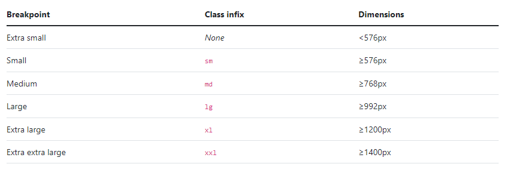

## Writing Test Week 4
## Asynchronus Fetch
- Dalam JavaScript kita bisa mengirimkan network request dan juga bisa mengambil informasi data terbaru dari server jika dibutuhkan.
- Contoh network request yang biasa kita lakukan:
  - Mengirimkan data dari sebuah form.
  - Mengambil data untuk ditampilkan dalam list/table.
  - Mendapatkan notifikasi.
- Dalam melakukan network request, JavaScript memiliki metode bernama fetch().
- Proses melakukan fetch() adalah salah satu proses asynchronous di JavaScript sehingga kita perlu menggunakan salah satu diantara promise atau async/await.
#### Fetch dengan Promise
- Berikut ini contoh request data dengan fetch() menggunakan promise:
```javascript
fetch("https://jsonplaceholder.typicode.com/posts")
  .then(function (response) {
    return response.json();
  })
  .then(function (post) {
    console.log(post);
  });
```
#### Fetch dengan async/await
- Berikut contoh request data dengan fetch() menggunakan async/await:
```javascript
const tesFetchAsync = async () => {
  let response = await fetch("https://jsonplaceholder.typicode.com/posts");
  response = await response.json();
  console.log(response);
};
tesFetchAsync();
```

## Asynchronus async/await
- Async/await dan promise itu mirip, namun hanya berbeda dari syntax dan cara penggunaannya. Ada 2 kata kunci yang memiliki pengertian sebagai berikut:<br />
  - async, mengubah function synchronous menjadi asynchronous.<br />
  - await, menunda eksekusi hingga proses asynchronous selesai.
- Sebuah async function bisa tidak berisi await sama sekali atau lebih dari satu await. Keyword await hanya bisa digunakan didalam async function, jika digunakan di luar async function maka akan terjadi error.
#### Async
- Berikut ini contoh penggunaan dari async :
```javascript
// async menggunakan keyword function 
async function tesAsyncAwait() {
  return "Fulfilled";
}

console.log(tesAsyncAwait());
// async menggunakan arrow function
const tesAsyncAwait = async () => {
  return "Fulfilled";
};
```
#### Await
- Await hanya bisa digunakan dalam async function dan await adalah keyword dalam async yang digunakan untuk menunda hingga proses asynchronous selesai.
- Berikut ini contoh penggunaan dari async/await :
```javascript
async function tesAsyncAwait() {
   await 'Fulfilled';
}
```
- Kita juga bisa memberikan error handling pada async/await. Contoh lengkap penggunaan async/await:
```javascript
// Definisikan dahulu promise yang ingin digunakan
let condition = true;
let tesAsyncAwait = async (condition) => {
  if (condition) {
    return "Condition is fulfilled!";
  } else {
    throw "Condition is rejected!";
  }
};

// Membuat fungsi run menjadi asynchronous menggunakan async/await
const run = async (condition) => {
  try {
    const message = await tesAsyncAwait(condition);
    console.log(message);  // Output: Condition is fulfilled!
    console.log("After condition is fulfilled"); // Output: After condition is fulfilled
  } catch (error) {
    console.log(error);
  }
};

run(true);
```

## Git dan Github Lanjutan
- Git adalah aplikasi yang dapat melacak setiap perubahan yang terjadi pada suatu folder atau file.
- Git biasanya digunakan oleh para programmer sebagai tempat penyimpanan file pemrograman mereka, karena lebih efektif.
- File -file yg disimpan menggunakan git akan terlacak seluruh perubahannya, termasuk siapa yang mengubah.
- Agar bisa berkolaborasi kita membutuhkan repository untuk menyimpan program tersebut. Adapun layanan repository untuk menyimpan kode tersebut adalah github, bitbucket, dan gitlab. Beberapa perintah-perintah github yang digunakan untuk melakukan kolaborasi:<br />
•	git clone: untuk menggandakan atau mengcopy sebuah project.<br />
•	Git pull: Untuk menggabungkan semua perubahan yang ada di remote repository ke direktori lokal.<br />
•	Git branch: Perintah git branch bisa digunakan untuk me-list, membuat atau menghapus branch.<br />
•	Git merge: Perintah merge digunakan untuk menggabungkan sebuah branch ke branch aktif.

## Responsive Web Design
- Responsive Web Design bertujuan agar web kita dapat diakses dalam device apapun.
- Dalam membuat aplikasi  kita harus memikirkan user yang akan menggunakannya.
- Device yang umumnya digunakan adalah laptop/PC, smartphone, dan tablet.
#### Viewport Dalam HTML
- Dalam HTML, viewport mendefinisikan area di layar yang digunakan untuk menjelajahi halaman. Salah satu cara untuk membuat desain website mobile adalah dengan mengatur viewport.
#### Max-Width element
- Properti max-width digunakan untuk mengatur lebar maksimum elemen. Hal ini mencegah nilai properti lebar dari menjadi lebih besar dari max-lebar.
#### Media Query
- Adalah fitur untuk memberikan style khusus dengan suatu kondisi tertentu. Kondisi tertentu tersebut misalnya ukuran layar.
#### Breakpoint
- Perubahan yang terjadi pada tampilan saat berganti device atau ukuran width disebut breakpoint.
Bootstrap 5
- Bootstrap adalah framework web development berbasis HTML, CSS, dan JavaScript yang dirancang untuk mempercepat proses pengembangan web responsive dan mobile-first (memprioritaskan perangkat seluler).
- Fungsi Bootstrap adalah untuk membuat website responsive dan mobile-first. Jadi, semua elemen antarmuka website dipastikan bisa bekerja secara optimal di semua ukuran layar, baik desktop maupun perangkat seluler.
#### Breakpoint

#### Container
- Container adalah element layout yang paling dasar pada bootstrap. Kita wajib menggunakan container jika ingin menggunakan sistem grid bootstrap.
- Container bisa kita anggap sebagai wadah yang menampung semua element grid sistem atau element lainnya dari bootstrap.
#### Grid
- Grid System pada bootstrap merupakan pengaturan ukuran yang di tampilkan pada monitor. grid system berfungsi untuk membuat pengaturan untuk lebar dari masing-masing komponen web sehingga kita dapat dengan bebas mengatur ke-responsif an halaman website yang kita buat dengan bootstrap.
- Bootstrap memiliki 12 grid. yang nantinya kita akan dapat menggunakan class berikut ini untuk mengatur keresponsive an halaman website dengan mengaturnya menggunakan 12 grid bootstrap. 

