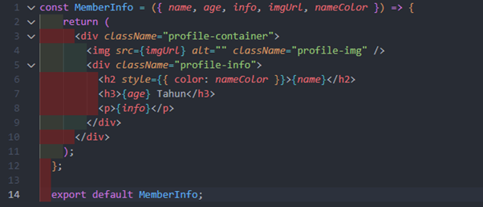
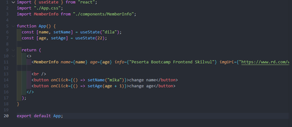
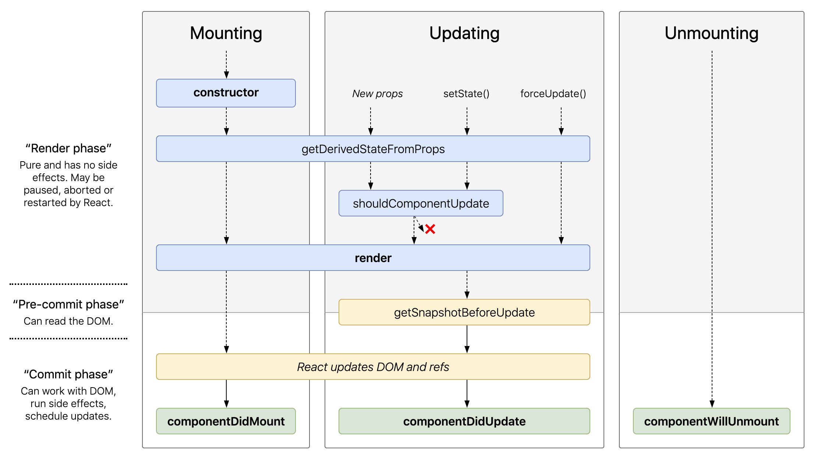

## Writing test Week 6
### Introduction React JS
- React JS adalah Library Javascript yang bersifat Open Source yang mayoritas digunakan untuk membangun User Interface (UI) secara spesifik untuk satu page dalam aplikasi. React JS berfungsi untuk mengatur Layer pada tampilan untuk Desktop maupun versi mobile Aplikasi. Dengan React, kita bisa membuat Reusable Component atau jenis komponen yang bisa kamu gunakan kembali tanpa harus membangunnya dari awal lagi. 
Kenapa menggunakan React JS?<br />
1.	React JS is FAST<br />
React JS membuat aplikasi front-end menjadi lebih cepat walaupun harus menghandle berbagai data. <br />
2.	React JS is Modular<br />
Kita dapat menerapkan konsep modular javascript pada React JS. React JS membagi 1 tampilan pada website menjadi komponen-komponen kecil. <br />
3.	React JS is Scalable<br />
React JS dapat digunakan pada aplikasi berskala kecil hingga berskala besar dan kompleks.<br />
4.	React JS is Popular<br />
Komunitas React JS di seluruh dunia sangat besar. Kebanyakan perusahaan teknologi pun sudah menggunakan React JS. Jadi akan mudah mendapatkan pekerjaan jika kita dapat menguasai React JS.
- JSX adalah syntax extension for javascript. JSX dikembangkan untuk digunakan pada React JS. JSX perlu dicompile untuk menjadi javascript. Jadi sebelum ditampilkan pada browser, JSX akan dicompile menjadi javascript terlebih dahulu. Dengan menggunakan JSX kita dapat menggunakan HTML didalam file extension Javascript (.js).
- JSX rules: Setiap JSX hanya bisa memiliki 1 parent element. Tag element ``<div>`` dan tag fragment ``<>`` dapat digunakan sebagai parent dari element lain pada komponen.
- Virtual DOM<br />
React JS mempunyai fitur Virtual DOM. Virtual DOM adalah duplikasi dari real DOM yang sebenarnya. Virtual DOM ini yang membuat React JS menjadi lebih ceapt dalam performance.
- Class dan className<br />
Pada JSX attribut class di tag element HTML harus menggunakan className.
- Curly Braces dalam JSX<br />
Kita dapat menggunakan syntax javascript di dalam element HTML dengan curly braces.
- Variable dalam JSX<br />
Untuk akses variable dalam JSX dapat menggunakan curly braces.
### React JS Component
- Component adalah salah satu core dari React JS. Component membagi UI dalam satuan-satuan kecil. Artinya dalam 1 page ada beberapa component yang bisa kita buat. Component dibuat jika component tersebut bersifat reusable code.
  - Gunakan function
  - Gunakan class<br />
Kebanyakan kasus dan dokumentasi resmi React JS merekomendasikan menggunakan function.
##### State dan Props
- State & Props adalah hal yang berhubungan dengan Stateless & Stateful Component. 
- Stateless berarti tidak memiliki State. Dia hanya memiliki props.

- Stateful berarti memiliki state dan bisa mengirim state tersebut ke component.

##### Handling event & Conditional Rendering
##### Handling Event<br />
Handling atau penanganan event pada element React mirip dengan event yang ada pada Javascript, namun dengan beberapa perbedaan yaitu:
-	Penamaan event pada React menggunakan camelCase, tidak lagi lowercase
-	Event handler diisi dengan nama fungsi saja, tidak perlu pemanggilan fungsi.
Contoh event ``onClick`` yaitu:
```jsx
<button onClick={() => setAge(age + 1)}>change age</button>
```
##### Conditional Rendering<br />
Digunakan untuk menentukan komponen mana yang akan di render. Conditional rendering dalam react bekerja seperti conditional dalam javascript.
### Lifecycle Method dan Hooks
##### Hooks
- Hooks adalah fitur yang baru dikenalkan di React JS pada tahun 2018. Inti dari hooks, adalah untuk memudahkan pengguna functional components agar bisa menggunakan state, dan lifecycle lainnya.
- Sebelumnya, state ( setState ) dan lifecycle (componentDidMount, componentDidUpdate) hanya bisa digunakan di class component, namun dengan hooks, kita bisa menggunakannya di functional component.
- Hooks yang sering digunakan adalah useState, dan useEffect, dua hal ini sama dengan state, dan lifecycle di class yang biasa kita sering gunakan.
- Perbedaan functional component dan class component<br />
Perbedaannya functional component code yang diketik kan lebih clean, pendek dan mudah dimengerti daripada class component. Banyak yang merekomendasikan menggunakan functional component daripada class component.
- useState syntax
```JSX
Const [name, setName] = useState(initialvalue);
```
- Cara penggunaan useState Hooks<br />
1.	Import useState dari react<br />
2.	Menuliskan useState hooks<br />
3.	Pemanggilan data<br />
4.	Update state
- Penggunaan useState Hooks<br />
useState biasanya akan digunakan saat menyimpan data suatu form yang nantinya akan dipost ke api untuk di proses. Case lainnya adalah saat melakukan call api, kita bisa menyimpan hasil get dari api tersebut kedalam state menggunakan useState.
- useEffect Hooks<br />
useEffect merupakan hooks yang bisa digunakan untuk menggunakan lifecycle pada functional component dengan mudah.
- Penggunaan useEffect hooks<br />
useEffect biasanya digunakan saat membuat suatu call api, karena api akan selalu dipanggil saat komponen terbentuk, maka call api bisa dilakukan di dalam useEffect.
##### Lifecycle
- lifecycle yang ada didalam hooks, hanya menggunakan useEffect yang menyatukan componentDidMount, componentDidUpdate, dan componentWillUnmount.
- Struktur lifecycle

### Form
- Cara penulisan ``form`` di react:
```JSX
<form>
   <label>
      Name:
      <input type=”text” name=” />
   </label>
   <input type=”submit” value=”submit” />
</form>
```
